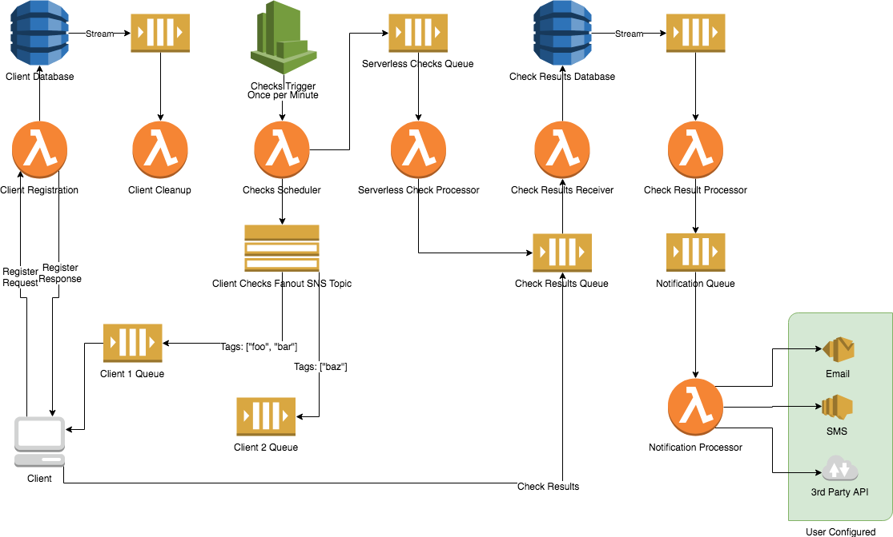

# Cloud Monitoring Development Framework

A framework for creating monitoring systems leveraging Amazon AWS services.

- Configuration as Code
- Easy Deployment
- Cost Effective

```kotlin
import us.aharon.monitoring.core.*

class App : Application() {

    override val checks = listOf(
            checks("example") {
                check("CPU") {
                    command     = "/nagios/plugins/check_cpu --warning 75 --critical 85"
                    interval    = 5
                    tags        = listOf("linux")
                    contacts    = listOf("devops")
                    handlers    = listOf(DefaultHandler::class)
                } 
                serverlessCheck("Database cluster health") {
                    executor = CheckDatabaseClusterHealth::class
                    interval = 15
                }
            }
    )
}

fun main(vararg args: String) = App().run(args)
```

- The monitoring application, `App`, runs on AWS Lambda.
- Triggers two checks.
    - The `CPU` check is run every 5 minutes and will be run on clients 
    subscribed to the `linux` tag.
    - The `Database cluster health` check is run every 15 minutes and is
    run in AWS Lambda.

## Principals

### Configuration as Code
By using a DSL written in Kotlin the compiler can check the validity of 
your configuration.  No more pushing broken configuration files to a
monitoring system configured by flat files.   
The IDE can tell you which configuration options are available, which 
types of values they require, and show you their documentation.  No more
searching the internet for parameter names or configuration options.

### Easy Deployment
The monitoring application compiles to a single, executable `JAR` file.   
Run the compiled application to deploy it with your desired command-line 
parameters.   
By using Amazon AWS services like Lambda, SNS, SQS, and DynamoDB no 
server/container management is required.

### Cost Effective
For small to medium sized infrastructures the usage will fall under 
Amazon AWS's **free tier**.

## Architecture


## Components
### Application
The `Application` class.

### Checks
- Interval
- Contacts
- Handlers

### Client Checks
- Tagging
- Queues

### Serverless Checks
- The `ServerlessExecutor` abstract class.

### Notification Handlers
- The `NotificationHandler` abstract class.

## TODO
- [ ] Enable log-level control.
    - Move the verbose logging to the DEBUG log level.
- [ ] Add `heartbeat` check.
    - This runs separate from the regular check-scheduler.
    - Send a "heartbeat" message to all clients.
    - Record the last heartbeat in the database under the Client's metadata.
- [ ] Add IAM Policy and Role for clients.
    - Read from the Parameter Store value for registration.
    - Invoke the registration Lambda function.
    - Read from the client's check queue.
    - Write to the result queue.
    - The Policy and Role should have fixed names.
- [x] Refactor DynamoDB tables into single table.
    - https://docs.aws.amazon.com/amazondynamodb/latest/developerguide/HowItWorks.CoreComponents.html?shortFooter=true
    - https://docs.aws.amazon.com/amazondynamodb/latest/developerguide/best-practices.html
- [ ] Refactor DSL to use Builder Pattern and `@DslMarker` annotation correctly.
    - https://kotlinlang.org/docs/reference/type-safe-builders.html#scope-control-dslmarker-since-11
    - https://proandroiddev.com/writing-kotlin-dsls-with-nested-builder-pattern-66452476d5ef
    - https://youtu.be/Rvx_BfG3NDo?t=2090
- [x] Specify `Environment` for all AWS resources.
    - See `Deploy` class.
- [x] Create IAM Role with specified policies for the `NotificationHandler` abstract base class.
    - Assume the appropriate IAM Role in the `NotificationProcessor`.
- [x] Create IAM Role with the specified policies for the `ServerlessExecutor` abstract base class.    
    - Assume the appropriate IAM Role in the `ServerlessCheckProcessor`.
- [ ] Refactor logging to use a different backend.
    - Lambda cold-start time may be improved by using `tinylog` or `logback`.
- [ ] Change check notification handlers from a `List` to a `Set`.
