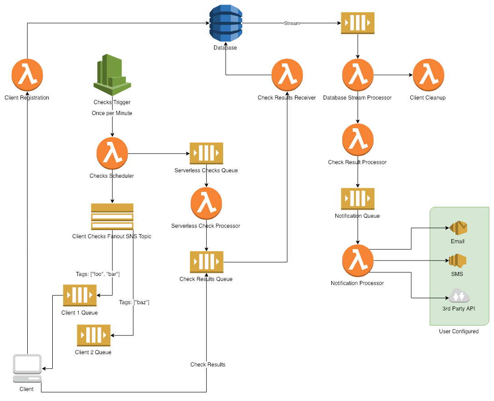

# Cloud Monitoring Development Framework

A framework for creating monitoring systems leveraging Amazon AWS services.

- Configuration as Code
- Easy Deployment
- Cost Effective

```kotlin
import us.aharon.monitoring.core.*

class App : Application() {

    override val checks = listOf(
            checks("example") {
                check("CPU") {
                    command     = "/nagios/plugins/check_cpu --warning 75 --critical 85"
                    interval    = 5
                    tags        = listOf("linux")
                    contacts    = listOf("devops")
                    handlers    = listOf(DefaultHandler::class)
                } 
                serverlessCheck("Database cluster health") {
                    executor = CheckDatabaseClusterHealth::class
                    interval = 15
                }
            }
    )
}

fun main(vararg args: String) = App().run(args)
```

- The monitoring application, `App`, runs on AWS Lambda.
- Triggers two checks.
    - The `CPU` check is run every 5 minutes and will be run on clients 
    subscribed to the `linux` tag.
    - The `Database cluster health` check is run every 15 minutes and is
    run in AWS Lambda.

## Principals

### Configuration as Code
By using a DSL written in Kotlin the compiler can check the validity of 
your configuration.  No more pushing broken configuration files to a
monitoring system configured by flat files.   
The IDE can tell you which configuration options are available, which 
types of values they require, and show you their documentation.  No more
searching the internet for parameter names or configuration options.

### Easy Deployment
The monitoring application compiles to a single, executable `JAR` file.   
Run the compiled application to deploy it with your desired command-line 
parameters.   
By using Amazon AWS services like Lambda, SNS, SQS, and DynamoDB no 
server/container management is required.

### Cost Effective
For small to medium sized infrastructures the usage will fall under 
Amazon AWS's **free tier**.

## Architecture


## Components
### Application
The `Application` class is the entry point for both the CLI and Serverless
parts of the framework.  It is an instance of `Application` where checks are 
registered or defined.   

An example `Application` implementation:   
```kotlin
import us.aharon.monitoring.core.api.Application

class MyMonitoringApp : Application() {

    override val checks = listOf(
            LINUX_CHECKS,
            METRIC_CHECKS
    )
}

fun main(vararg args: String) = App().run(args)
```
In the example above, `LINUX_CHECKS` and `METRIC_CHECKS` are groups of checks
defined elsewhere in the project.

### Checks
There are two types of checks which the framework defines.   

#### Client Checks
Client checks are run on a server instance or within a Docker container.   
The `LINUX_CHECKS` from the `Application` example might be defined like so:
```kotlin
import us.aharon.monitoring.core.api.checks
import us.aharon.monitoring.core.api.check

val LINUX_CHECKS = checks("Linux System") {

    check("CPU") {
        command      = "/usr/lib64/nagios/plugins/check_cpu --warning 75 --critical 85"
        tags         = listOf("linux")
        interval     = 5 // Minutes
        handlers     = listOf(DefaultHandler::class)
        notification = "CPU usage is high"
        contacts     = listOf("my-team@acme.com")
    }
    
    check("Load") {
        command      = "/usr/lib64/nagios/plugins/check_load --warning 5,5,5 --critical 10,10,10"
        tags         = listOf("linux")
        interval     = 5
        handlers     = listOf(DefaultHandler::class)
        notification = "Load is high"
        contacts     = listOf("my-team@acme.com")
    }
}
```
Two checks are defined here within the `Linux System` check group.   
They both use Nagios checks which are commonly found on Linux systems and
run at five minute intervals.   
On state changes (OK to WARNING, CRITICAL to OK, etc) the `DefaultHandler` class
will be triggered to run (covered in the _Notification Handler_ section).   
The `contacts` here are email addresses, but that is not a requirement.

#### Serverless Checks
Serverless checks are run within AWS Lambda.   
The `METRIC_CHECKS` from the `Application` example might perform queries on a Graphite instance:
```kotlin
import us.aharon.monitoring.core.api.checks
import us.aharon.monitoring.core.api.serverlessCheck

val METRIC_CHECKS = checks("Graphite") {

    serverlessCheck("Web Server Latency") {
        executor   = GraphiteCheckWebServerLatency::class
        interval   = 3
        additional = mapOf(
            "query"    to "avg(percentileOfSeries(webserver.*.latency, 95))",
            "from"     to "-10minutes",
            "warning"  to "100",
            "critical" to "300")
    }
}
```
This check will run in AWS Lambda using the `GraphiteCheckWebServerLatency` class.   
Serverless checks are implemented by extending the `ServerlessExecutor` abstract class.   
In this example the serverless check executor expects expects additional metadata
which is provided via the `additional` property.

The core concepts of creating checks consist of:

- Command/Executor   
The shell command to run (if running on a server), or the user-defined class which will execute in the cloud.
- Tags   
Clients running server-side subscribe to checks via a tagging system.   
For instance, if a client subscribes to the tags `linux`, `nginx`, and `mysql`, then it
will only be instructed to perform checks that correspond to those tags.
- Interval   
Intervals are run minutely, with one minute being the shortest interval available.
- Handlers   
Handlers are triggered to run when a check undergoes a state change.   
For example, if the client running on the server `web-1.example.com` reports that CPU usage is at
a critical level, then that check's `handler` will be run to send a notification to
the configured `contacts`.
- Contacts   
Configured via the `contacts` property, these can be whatever is appropriate for the situation.   
In the example above we used an email address.

### Default Check Properties
Many checks will share the same properties, like `contacts`, `interval`, `handlers`, and `tags`.   
In order to avoid repeating these values _Check Templates_ can be created.   
Here are two example check templates.  One for client/server checks, and a second for serverless checks.
```kotlin
import us.aharon.monitoring.core.api.clientCheckTemplate
import us.aharon.monitoring.core.api.serverlessCheckTemplate

val defaultClientCheck = clientCheckTemplate {
    interval = 5
    handlers = listOf(DefaultHandler::class)
    tags     = listOf("linux")
    contacts = listOf("sysadmin@example.com")
}

val defaultServerlessCheck = serverlessCheckTemplate {
    interval = 15
    contacts = listOf("sysadmin@example.com")
}
```
These two check templates can now be used elsewhere and will inherit the 
configuration properties from the templates defined above:
```kotlin
val EXAMPLE_TEMPLATE_CHECKS = checks("Example Template Checks") {

    defaultClientCheck("RSyslog is running") {
        command = "/usr/lib64/nagios/plugins/check_procs --critical 1:1 --command rsyslog"
    }
    
    defaultServerlessCheck("Running in us-east-1") {
        executor = CheckRunningInUSEast1::class
    }
}
```

### Serverless Check Executors
The `ServerlessExecutor` is an abstract class which can be implemented to perform any desired check.   
Instead of the check running on a server or container, it will run within AWS Lambda.   
A contrived example: 
```kotlin
import com.amazonaws.auth.AWSCredentialsProvider
import com.amazonaws.services.identitymanagement.AmazonIdentityManagementClientBuilder
import com.amazonaws.services.lambda.runtime.Context
import us.aharon.monitoring.core.checks.*

class CheckIamUsers : ServerlessExecutor() {

    override val permissions: List<Permission> = listOf(
            Permission(
                    actions = listOf("iam:ListUsers"),
                    resources = listOf("*"))
    )

    override fun run(check: ServerlessCheck, ctx: Context, credentials: AWSCredentialsProvider): Result {
        val iamClient = AmazonIdentityManagementClientBuilder.standard()
                .withCredentials(credentials)
                .build()
        val iamUsers = iamClient.listUsers().users
        ctx.logger.log("Found the following users:  $iamUsers")
        if (iamUsers.size > 10) {
            return Critical("CRITICAL - ${iamUsers.size} users is too many!")
        }
        return Ok("OK - ${iamUsers.map { it.userName }}")
    }
}
```
This check will run in AWS Lambda.   
The `permissions` property defines which IAM policies it will require to perform its actions.   
During deployment of the monitoring application an IAM Role will be created with those permissions.   
When the check is executed, it will perform `AssumeRole` and retrieve IAM credentials.   
The `credentials` for that assumed role are provided to the `run` function.

### Notification Handlers
Notification handlers are triggered by state changes for a specific client-check pair.   
If `client1` runs check `CPU` and reports a state change from `OK` to `CRITICAL`, then the 
notification handler defined on the `CPU` check will be triggered to run.   
Notification handlers are created by extending the `NotificationHandler` abstract class.   

Here is an example which emails the check's configured `contacts`:
```kotlin
import com.amazonaws.auth.AWSCredentialsProvider
import com.amazonaws.services.lambda.runtime.Context
import com.amazonaws.services.simpleemail.AmazonSimpleEmailServiceClientBuilder
import com.amazonaws.services.simpleemail.model.*
import us.aharon.monitoring.core.checks.*
import us.aharon.monitoring.core.db.CheckResultRecord
import us.aharon.monitoring.core.handlers.NotificationHandler

class EmailNotificationHandler : NotificationHandler() {

    override val permissions: List<Permission> = listOf(
            Permission(
                    actions = listOf("ses:SendEmail"),
                    resources = listOf("arn:aws:ses:*:*:identity/example.com"))
    )

    override fun run(check: Check, checkResult: CheckResultRecord, ctx: Context, credentials: AWSCredentialsProvider) {
        val request = SendEmailRequest()
                .withSource("alert@example.com")
                .withDestination(Destination(check.contacts))
                .withMessage(Message(
                        Content("${checkResult.status} - ${checkResult.source} - ${check.notification}"),
                        Body(Content("""
                            Message:  ${check.notification}
                            Source:   ${checkResult.source}
                            Status:   ${checkResult.status}
                            Timestamp:  ${checkResult.completedAt}

                            Output:
                            ${checkResult.output}
                        """.trimIndent()))
                ))
        val client = AmazonSimpleEmailServiceClientBuilder.standard()
                .withCredentials(credentials)
                .build()
        client.sendEmail(request)
        ctx.logger.log("Sent email.")
    }
}
```

## Deployment
The monitoring application is designed to compile to a single fat JAR which can 
deploy itself.   
```
Usage: java -jar app.jar deploy [-hV] [--dry-run] -d=DEST -e=ENV -n=NAME -r=REGION
Deploy application to the cloud
      --dry-run           Generate and validate the CloudFormation template without
                            installing the application
  -d, --s3-dest=DEST      S3 Bucket and path as upload destination. eg.
                            <bucket>/path/
  -e, --environment=ENV   A name given to the environment for this application (prd,
                            dev, ...)
  -h, --help              Show this help message and exit.
  -n, --stack-name=NAME   CloudFormation Stack name
  -r, --region=REGION     AWS region
  -V, --version           Print version information and exit.
```
An example invocation of the `deploy` CLI command would look like this:
```
$ java -jar ./target/app-1.x.x.jar deploy --environment dev --s3-dest my-monitoring-bucket/dev/ --stack-name mon-dev --region us-east-1
CloudFormation template is valid.
Uploading ./target/app-1.x.x.jar
Uploading dev/cfn-template-dev-1549716815865.yaml
The `mon-dev` stack does not exist.
Template URL:  https://s3.amazonaws.com/my-monitoring-bucket/dev/cfn-template-dev-1549716815865.yaml
Creating the stack named `mon-dev`...
Stack `mon-dev` status:  CREATE_IN_PROGRESS
...
Stack `mon-dev` status:  CREATE_COMPLETE
```

## TODO
- [ ] Enable log-level control.
    - Move the verbose logging to the DEBUG log level.
- [ ] Add `heartbeat` check.
    - May run separate from the regular check-scheduler.
    - Send a "heartbeat" message to all clients.
    - Record the last heartbeat in the database under the Client's metadata.
- [ ] Add IAM Policy and Role for clients.
    - Read from the Parameter Store value for registration.
    - Invoke the registration Lambda function.
    - Read/delete from the client's check queue.
    - Write to the result queue.
    - The Policy and Role should have fixed names.
- [x] Refactor DynamoDB tables into single table.
    - https://docs.aws.amazon.com/amazondynamodb/latest/developerguide/HowItWorks.CoreComponents.html?shortFooter=true
    - https://docs.aws.amazon.com/amazondynamodb/latest/developerguide/best-practices.html
- [ ] Refactor DSL to use Builder Pattern and `@DslMarker` annotation correctly.
    - https://kotlinlang.org/docs/reference/type-safe-builders.html#scope-control-dslmarker-since-11
    - https://proandroiddev.com/writing-kotlin-dsls-with-nested-builder-pattern-66452476d5ef
    - https://youtu.be/Rvx_BfG3NDo?t=2090
- [x] Specify `Environment` for all AWS resources.
    - See `Deploy` class.
- [x] Create IAM Role with specified policies for the `NotificationHandler` abstract base class.
    - Assume the appropriate IAM Role in the `NotificationProcessor`.
- [x] Create IAM Role with the specified policies for the `ServerlessExecutor` abstract base class.    
    - Assume the appropriate IAM Role in the `ServerlessCheckProcessor`.
- [ ] Refactor logging to use a different backend.
    - Lambda cold-start time may be improved by using `tinylog` or `logback`.
- [ ] Change check notification handlers from a `List` to a `Set`.
- [ ] Add VPC support.
- [ ] CloudWatch alarm for Lambda errors.
- [ ] Add HTTP API.
    - Deleting/disabling clients.
    - External health check.
- [ ] Add web UI.
- [ ] Support for AWS credential profiles (`~/.aws/credentials`) for CLI deployment.
- [ ] Implement check timeouts.
- [ ] Implement flapping detection.
- [ ] Implement occurrences notification handling.
- [ ] Implement `volatile` checks.
    - Checks which are not scheduled by the backend, but instead reported asynchronously by the client.
